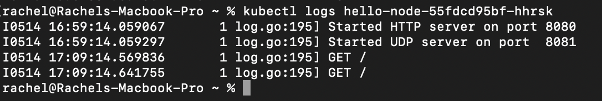

# Tutorial 11 - Deployment & Monitoring
**Rachel Heningtyas Zanetta Erari - 2206081944 - A**

## Minikube Reflection
###  Compare the application logs before and after you exposed it as a Service. Try to open the app several times while the proxy into the Service is running. What do you see in the logs? Does the number of logs increase each time you open the app?

Every time I open the app, it logs a GET request in the HTTP protocol. This count doubles each time I use the app because of the direct interaction with it.

### Notice that there are two versions of kubectl get invocation during this tutorial section. The first does not have any option, while the latter has -n option with value set to kube-system. What is the purpose of the -n option and why did the output not list the pods/services that you explicitly created?

The -n option in kubectl get allows us to specify which group of resources we want to view. When we use -n followed by a specific namespace, such as kube-system, it only shows resources from that area. If we don't see the pods or services we created when we run kubectl get without -n, it's probably because they were created in a different namespace than the default one. Therefore, we need to specify that namespace using -n to see them.

## Rolling Update & Recreate Reflection
### What is the difference between Rolling Update and Recreate deployment strategy?
A rolling update is a deployment strategy that updates a deployment by gradually replacing old pods with new ones. It creates new pods and then deletes the old ones. In contrast, the Recreate deployment strategy temporarily brings down the entire service by replacing all pods simultaneously, which can result in noticeable downtime.

### What do you think are the benefits of using Kubernetes manifest files? Recall your experience in deploying the app manually and compare it to your experience when deploying the same app by applying the manifest files (i.e., invoking kubectl apply -f command) to the cluster.
Using Kubernetes manifest files has several advantages over manual deployment. These files provide a declarative configuration that describes the desired state of Kubernetes resources, which improves reproducibility and reduces errors. With version control, you can track changes over time, making collaboration easier and allowing for quick rollbacks if necessary. Automation with tools like kubectl apply streamlines the deployment process, ensuring consistency and minimizing manual intervention.
